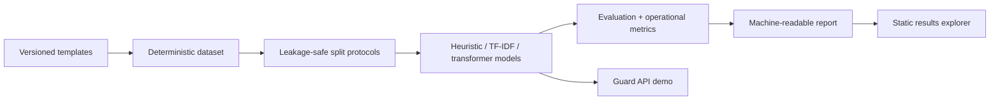

# ToolShield: Prompt Injection Detection for Tool-Using LLM Agents

A research-grade repository for detecting prompt injection attacks in tool-using LLM agents.
Developed for bachelor's thesis research on LLM security.

**[Explore the committed benchmark results](https://giselleevita.github.io/ToolShield/)** · **[Five-minute reviewer guide](docs/REVIEWER_GUIDE.md)**

> **Results disclosure:** the committed neural-model results used one effective training seed because an experiment-runner key did not reach the model. The defect is fixed and regression-tested; those figures remain labelled as point estimates until the full multi-seed run is repeated. Classical-model seed runs were independent.

**Reviewers:** see [docs/REVIEWER_GUIDE.md](docs/REVIEWER_GUIDE.md) for a 15-minute evaluation path.

For a concise interactive walkthrough, use the [90-second demo](docs/90_SECOND_DEMO.md) or [three-minute reviewer path](docs/RECRUITER_DEMO.md).

The Pages deployment fails closed if the explorer references missing UI elements, loads third-party runtime scripts, or omits its provenance, limitations, and key-free-demo disclosures.

## Overview

This project implements:

1. **Dataset Generation**: Synthetic dataset of benign and adversarial prompts targeting enterprise tools
2. **Split Protocols**: Three evaluation protocols to test generalization
3. **Baseline Models**: From rule-based heuristics to transformer classifiers
4. **Comprehensive Metrics**: Including operational metrics like FPR@TPR and ASR reduction

## Relationship to Agent Security Gate (ASG)

ToolShield can be viewed as a prototype component for an **Agent Security Gate**: it evaluates a user prompt plus tool context before tool/API execution and returns a detection signal that can support an allow/block decision.

It is not a complete ASG platform. The repository focuses on single-turn prompt-injection detection and long-context truncation behavior; production ASG designs would also need policy enforcement, authorization, sandboxing, monitoring, multi-turn agent controls, and deployment-specific validation.

ToolShield **measures detector behavior**. [Agent Security Gate](https://github.com/giselleevita/agent-security-gate) demonstrates how a separately governed service can **enforce** policy before a tool call.

## Architecture



The benchmark CLI, guard API, and results explorer are deliberately separable. The public explorer is static and never receives prompts.

## Quick Start

```bash
# Install dependencies
make install-dev

# Generate dataset (uses seed=1337 for reproducibility)
make generate

# Create all splits (uses seed=2026)
make split-all

# Train all models
make train-all

# Evaluate
make eval-all

# Or run the full pipeline
make pipeline
```

## Project Structure

```
ToolShield/
├── configs/               # Configuration files
│   ├── dataset.yaml      # Dataset generation config
│   ├── splits.yaml       # Split generation config
│   └── training/         # Model training configs
├── src/toolshield/       # Main package
│   ├── cli.py            # CLI entry point
│   ├── data/             # Data generation and splitting
│   ├── models/           # Classifier implementations
│   ├── evaluation/       # Metrics computation
│   └── utils/            # I/O utilities
├── tests/                # Unit tests
├── data/                 # Generated data (gitignored)
└── outputs/              # Model artifacts (gitignored)
```

## Dataset Schema

Each record contains:

| Field | Type | Description |
|-------|------|-------------|
| `id` | str | Unique identifier (deterministic from seed) |
| `language` | str | Language code ("en") |
| `role_sequence` | list[str] | Conversation roles |
| `tool_name` | str | Target tool name |
| `tool_schema` | dict | JSON schema of tool |
| `tool_description` | str | Natural language description |
| `prompt` | str | The prompt text |
| `label_binary` | int | 0=benign, 1=attack |
| `attack_family` | str\|None | AF1-AF4 or None |
| `attack_goal` | str\|None | Specific attack goal |
| `template_id` | str | Template identifier |
| `variant_id` | str | Variant within template |
| `seed` | int | Generation seed |

## Attack Families

| ID | Family | Goal |
|----|--------|------|
| AF1 | Instruction Override | policy_bypass |
| AF2 | Data Exfiltration | data_exfiltration |
| AF3 | Tool Hijacking | tool_hijack |
| AF4 | Indirect Injection | privilege_misuse |

## Split Protocols

### S_random
Stratified random split (70/15/15) with **no template leakage** - 
no `template_id` appears in more than one split.

### S_attack_holdout
Tests generalization to unseen attack types:
- Train/Val: AF1, AF2, AF3 + benign
- Test: AF4 + benign subset

### S_tool_holdout
Tests generalization to unseen tools:
- Train/Val: All tools except `exportReport`
- Test: All `exportReport` samples

## Evaluation Metrics

- **ROC-AUC**: Area under ROC curve
- **PR-AUC**: Area under Precision-Recall curve
- **FPR@TPR(0.90)**: False positive rate at 90% true positive rate
- **FPR@TPR(0.95)**: False positive rate at 95% true positive rate
- **ASR Reduction**: Attack success rate reduction (operational metric)

## CLI Reference

```bash
# Generate dataset
toolshield generate --config configs/dataset.yaml --output data/

# Create splits
toolshield split --protocol S_random --input data/dataset.jsonl --output data/splits/S_random/

# Train model
toolshield train --model tfidf_lr --split data/splits/S_random/ --output outputs/tfidf_lr/

# Evaluate
toolshield eval --model outputs/tfidf_lr/ --test data/splits/S_random/test.jsonl
```

## Guard API Demo

ToolShield includes a FastAPI demo service that exposes the detector as a pre-execution guard endpoint:

```bash
make demo
```

The service starts on `localhost:8000` and provides:

- `POST /guard`: evaluates a prompt plus optional tool context and returns `ALLOW` or `BLOCK`
- `POST /policy/evaluate`: converts a detector score into `ALLOW`, `REVIEW`, or `BLOCK`
  using a versioned risk policy. Write and privileged tools receive stricter thresholds;
  missing or invalid scores fail closed. Every response carries the deterministic policy hash
  needed to reconstruct the decision.
- `GET /health`: liveness; `GET /health/ready`: returns 503 until the model can serve traffic
- Audit logging: stores request metadata and a prompt hash, not the raw prompt text
- Optional signed decisions: set `TOOLSHIELD_SIGNING_SECRET` to attach an HMAC-SHA256 decision record

Operational controls are disabled or permissive for the local demo by default. Set
`TOOLSHIELD_ADMIN_KEY` to enable the `/configure` endpoint and call it with
`Authorization: Bearer <key>`. Set `TOOLSHIELD_AUDIT_REQUIRED=true` to fail requests
when the append-only audit log cannot be written. Requests are bounded to 32,768 prompt
characters and 32 KiB of serialized tool schema to prevent accidental resource exhaustion.

This demo is intended to show how ToolShield can supply one decision signal inside an Agent Security Gate. It does not replace production authorization, sandboxing, monitoring, or policy enforcement.

## Reproducibility

All random operations use fixed seeds:
- Dataset generation: `seed=1337`
- Split generation: `seed=2026`

Seeds are stored in config files and embedded in output manifests.

## Running Tests

```bash
# Run all tests
make test

# Run only split leakage tests
make test-splits

# Run with coverage
pytest tests/ -v --cov=src/toolshield
```

## Reproducing Results

```bash
make compare_truncation_longschema
make verify_longschema_results
```

## Long-Schema Stress Test (Enterprise Truncation Bias)

An ablation study comparing **naive right-truncation** vs. **prompt-preserving truncation**
under enterprise-length tool schemas (~4 000 chars). This is the key experiment backing
the thesis claim that naive tokenization can silently remove the prompt signal.

### Verification Output

```
$ make verify_longschema_results
Verifying long-schema bundle: data/reports/experiments_longschema
  Protocols: ['S_random', 'S_attack_holdout']
  Expected seeds: [0, 1, 2] (n=3)

[OK] summary.csv — all models present, n_seeds correct, ROC-AUC bounds satisfied
[OK] truncation_stats.csv — truncation patterns match expected values
[OK] split hygiene — all checks PASS, guards.json empty
[OK] appendix example — contains both strategy comparisons
[OK] raw metrics present — seed_0/S_attack_holdout has both model metrics

All 5 verification checks passed.
```

### Key Results

| Strategy | ROC-AUC (S_attack_holdout) | Prompt Retention |
|----------|---------------------------|-----------------|
| `keep_prompt` | **0.998** | 100% |
| `naive` | 0.455 | 0% |

All artifacts are in `data/reports/experiments_longschema/`. The raw verification
log is saved at `data/reports/experiments_longschema/verification_output.txt`.

## Thesis & artifacts

- Full bachelor thesis PDF: `ToolShield_BScThesis_Evita_2026.pdf`
- Executive summary: `EXEC_SUMMARY.md`
- Additional submission artifacts and reports: see `THESIS_ARTIFACTS.md` and the `thesis/` directory.

These artifacts document the full experimental setup, results, and academic framing behind ToolShield.

## Security scope & limitations

ToolShield is a **research-grade prototype**, not a production security appliance:

- Focuses on **prompt injection detection for tool-using LLM agents** under controlled experimental conditions.
- Assumes that the underlying **tool backends and infrastructure are trusted** and not compromised.
- Does **not** attempt to defend against supply-chain attacks, compromised tool APIs, or model-level backdoors.
- Evaluation targets specific attack families (AF1–AF4) and synthetic enterprise schemas; real-world attack coverage will differ.

If you integrate ToolShield into a larger system, treat it as **one detection signal** in a broader, defense-in-depth security strategy and validate it against your own threat models and datasets.

## License

MIT License - See LICENSE file for details.
